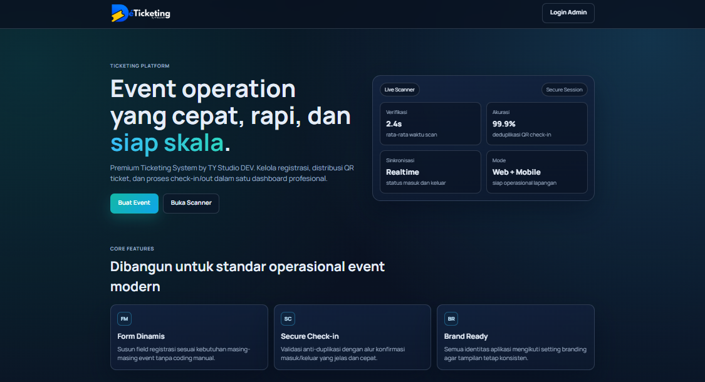

<!-- logo -->
<p align="center">

</p>

# DeTicketing

Sistem manajemen tiket dan pendaftaran event berbasis Nuxt 3, Prisma, dan SQLite. Dirancang untuk memberikan solusi manajemen pendaftaran yang aman, fleksibel, dan mudah diimplementasikan.

## Fitur Utama

### Manajemen Form & Penjadwalan

- **Pembangun Form Dinamis**: Mendukung berbagai tipe input mulai dari teks sederhana hingga unggahan file dan pilihan grid kompleks.
- **Checkout Rombongan (Multi-Ticket)**: Memungkinkan pendaftaran kolektif dalam satu pesanan (batch) dengan manajemen nama peserta tambahan secara dinamis.
- **Fleksibilitas Penjadwalan**: Dukungan untuk event satu hari maupun event berdurasi panjang (multi-day) dengan penanganan tanggal selesai otomatis.
- **Billing Summary Adaptif**: Kalkulasi biaya otomatis dengan tampilan ringkasan pembayaran yang profesional dan terstruktur untuk pesanan rombongan.

### Pelaporan dan Analitik

- **Professional Reporting (Export)**: Ekspor daftar pendaftar ke format **PDF** dan **CSV** secara instan dengan sinkronisasi kolom dinamis.
- **Smart Report Logic**: Kolom status kehadiran otomatis disesuaikan (muncul/sembunyi) pada laporan berdasarkan waktu pelaksanaan event.
- **Advanced Dashboard Trend**: Visualisasi tren pendaftaran yang akurat (7 hari, 30 hari, 1 tahun) dengan dukungan data hari ini (*real-time*).
- **Sinkronisasi Real-Time**: Monitoring pendaftaran dan perubahan status secara instan tanpa perlu memuat ulang halaman (Powered by WebSocket).

### Keamanan Data dan Privasi

- **Security Hardening**: Implementasi **HttpOnly Cookie** dan **SameSite: Strict** untuk perlindungan maksimal terhadap serangan CSRF dan XSS.
- **Global API Interceptor**: Penanganan error 401/403 secara otomatis untuk pembersihan sesi dan pengalihan login yang aman.
- **Enkripsi File**: Semua dokumen sensitif dan bukti pembayaran disimpan dalam keadaan terenkripsi di sisi server (**AES-256**).
- **Proteksi Anti-Spam**: Mekanisme sidik jari perangkat (device fingerprinting) untuk memitigasi pendaftaran ganda.

### Kontrol Akses Berbasis Peran (RBAC)

Mendukung pembagian tugas melalui peran **Admin**, **Panitia**, dan **Petugas**. Akses terhadap data event dan tiket dibatasi sesuai dengan penugasan staff yang ditetapkan oleh Admin/Owner.

### Operasional Lapangan

- **Advanced QR Scanner**: Pemindai QR berbasis web dengan validasi ketat antar event dan feedback audio-visual *real-time*.
- **Pemantauan Multi-Day**: Grafik kehadiran yang mendukung event berdurasi panjang dengan akumulasi data per jam yang akurat.
- **Automasi E-Ticket**: Pengiriman tiket elektronik secara otomatis segera setelah pendaftaran disetujui oleh admin.

## Teknologi Utama

- **Framework**: Nuxt 3 (Vue.js 3 & Nitro)
- **Real-Time**: WebSocket (Nitro/CrossWS)
- **ORM**: Prisma 7
- **Database**: SQLite / PostgreSQL / MySQL (Prisma compatible)
- **Keamanan**: JWT Authentication, SHA-256 Fingerprinting, AES-256 File Encryption, Nuxt Security
- **Reporting**: jsPDF, AutoTable
- **Email**: SMTP integration via Nodemailer

## Screenshot

<!-- screenshot -->
<p align="center">

</p>

## Instalasi

### Prasyarat

- Node.js versi 20 atau yang lebih baru
- npm versi 10 atau yang lebih baru

### Langkah-langkah

1. Clone repositori ini ke direktori lokal.
2. Jalankan instalasi dependensi:
   ```bash
   npm install
   ```
3. Lakukan inisialisasi basis data dan generate client Prisma:
   ```bash
   npm run prisma:generate
   npm run prisma:push
   ```

## Konfigurasi

Konfigurasi aplikasi dikelola melalui variabel lingkungan (environment variables). Secara default, aplikasi akan menggunakan SQLite lokal jika `DATABASE_URL` tidak didefinisikan.

Contoh konfigurasi pada file `.env`:

```env
NODE_ENV=production
PORT=1933
```

## Menjalankan Aplikasi

### Pengembangan (Development)

```bash
npm run dev
```

### Produksi (Production)

```bash
npm run build
npm run start
```

Untuk deployment menggunakan PM2, gunakan konfigurasi yang tersedia:

```bash
pm2 start ecosystem.config.cjs --env production
```

## Catatan Keamanan

- Kunci rahasia aplikasi (`APP_SECRET`) dikelola secara internal oleh server.
- Token QR Code bersifat unik per event dan dienkripsi untuk mencegah pemalsuan tiket.
- Seluruh file pendaftar tersimpan secara privat dan hanya dapat diakses melalui endpoint yang telah terautentikasi.

## Lisensi

MIT License — bebas digunakan, dan dimodifikasi untuk keperluan non-komersial
